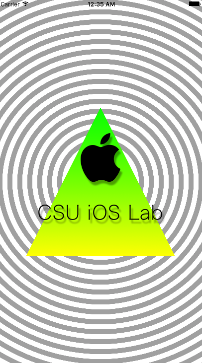

# iOSProgramming 4th EDITION

### Chapter 4 视图与视图层次结构  

知识点：  

1. 视图基础：  

    - 视图是UIView对象，或是其子类对象  
    - 视图知道如何绘制自己  
    - 视图可以处理事件  
    - 视图会按层次结构排列

2. UIView的属性：
  
    - frame属性，保存视图大小和相对于父视图的位置，单位是点，用于确定视图层次结构中其他视图的相对位置

    - backgroundColor

    - bounds: 用于确定绘制区域，避免将自己绘制到图层边界之外

3. 视图层次结构 UIWindow，subview，绘制过程  
4. 创建UIView子类  
5. 在drawRect:方法中自定义绘图，首先获取bounds属性  
6. 注意绘图时抬笔纠正位置  

类、方法：

1. UIView    superView属性

2. CGrect

    - CGrectMake
    - bounds  

3. UIColor

4. CGPoint

    - x
    - y  

5. UIBezierPath

6. UIImage

...去看API吧

## 关于初级练习和高级练习    

上传的代码中已经实现了相应的效果，包括阴影和渐变。  

  

建议是：多查文档，多看文档，多尝试～